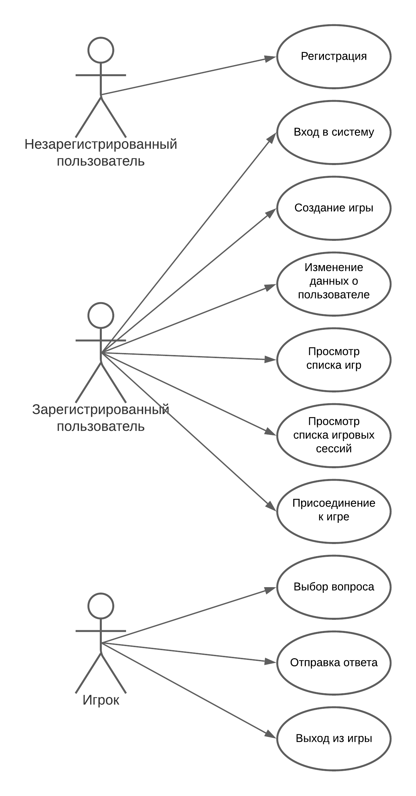

# Jeopardy!
## Цель работы
Создание веб-версии игры Jeopardy! (Своя игра)
## Функциональные требования
- Регистрация
- Вход в систему
- Изменение информации о пользователе
- Просмотр списка игр
- Просмотр списка игровых сессий 
- Создание игры
- Создание игровой сессии
- Присоединение к игре
- Выбор игроком вопроса
- Отправка игроком ответа
- Информирование игроков о ходе игры
- Выход из игры
## Use case диаграмма

## ER диаграмма

[Результаты нагрузочного тестирования с помощью ApacheBenchmark](docs/ab.md)
