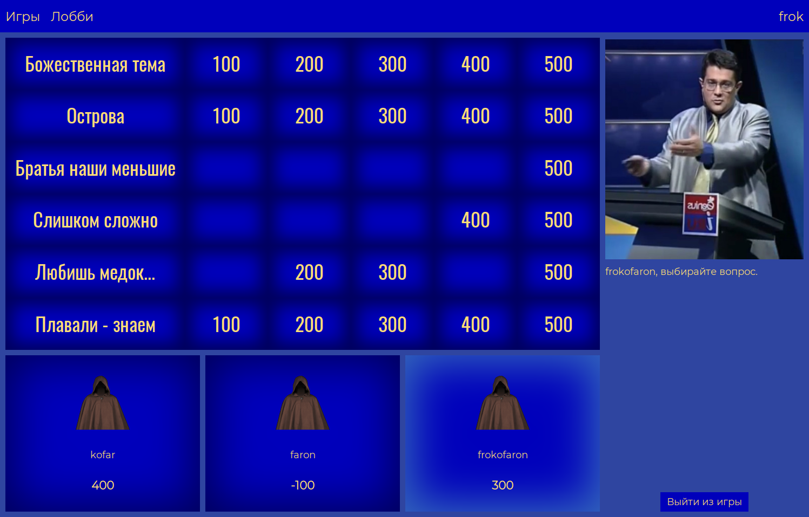
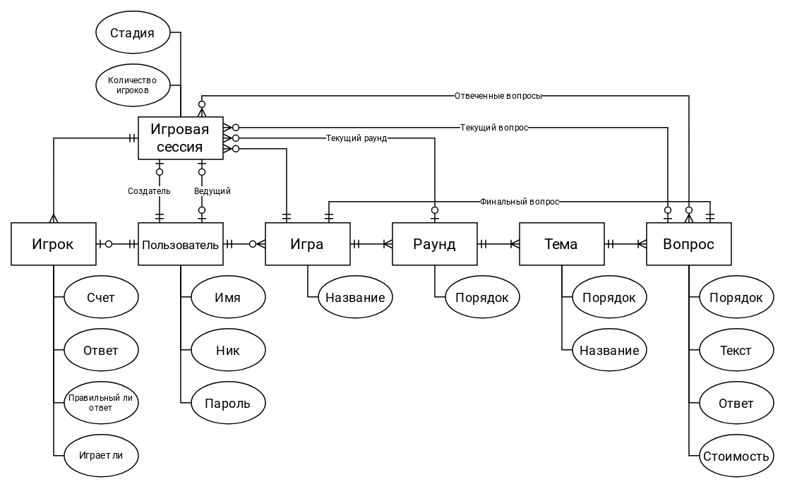

# Jeopardy!
Веб-версия телевизионного шоу [Своя игра](https://ru.wikipedia.org/wiki/Своя_игра) 
(локализованная [Jeopardy!](https://ru.wikipedia.org/wiki/Jeopardy!)).



## Процесс игры
Игра состоит из нескольких раундов, в которых участники выбирают вопросы из разных тем на игровой доске.
Каждый вопрос имеет свою стоимость. Если участник правильно ответил на вопрос, то он зарабатывает очки, равные
стоимости вопроса, иначе он теряет столько же очков. При неправильном ответе у игроков есть возможность 
дать другой ответ. Если никто из игроков не дал правильный ответ за отведенное время, то его показывает ведущий.
Следующий вопрос выбирает игрок, который последним дал правильный ответ.

Участник, являющийся ведущим, после выбора вопроса озвучивает его и затем разрешает отвечать игрокам. Отвечать будет
игрок, который быстрее соперников нажал на кнопку ответа. После ответа игрока ведущий подтверждает правильность
ответа или отклоняет его.

При игре без ведущего ответает игрок, быстрее соперников отправивший ответ.

В финальном раунде задается один вопрос, и игрокам за заданное время нужно отправить ответ на него. 
После этого ведущий зачитывает ответы игроков и проверяет их правильность.

По окончании игры победителем объявляется игрок, набравший наибольшее количество очков.

## Использование
Поиграть можно [тут](http://frokofaron.ru).

## Локальный запуск
Для запуска требуется [docker](https://docs.docker.com/get-docker/) и [docker-compose](https://docs.docker.com/compose/install/).
```shell
git clone https://github.com/pmineev/Jeopardy.git
cd Jeopardy
mv db.env.example db.env
mv django.env.example django.env
docker-compose -f docker-compose.yml -f docker-compose.prod.yml build web --build-arg HOST=127.0.0.1
docker-compose -f docker-compose.yml -f docker-compose.prod.yml run --rm web bash -c  "python manage.py makemigrations backend && python manage.py migrate"
docker-compose -f docker-compose.yml -f docker-compose.prod.yml up web -d
```
Приложение будет доступно по адресу http://127.0.0.1.

## Технологии
- [Django](https://www.djangoproject.com/) - бэкенд-фреймворк: маршрутизация, аутентификация, обработка HTTP-запросов,
доступ к БД.
    - [Django REST framework](https://www.django-rest-framework.org/) - дополнение для Django для построения REST API: представления и валидация данных.
    - [Simple JWT](https://django-rest-framework-simplejwt.readthedocs.io/) - дополнение для Django, производит 
аутентификацию по [JSON Web Token](https://ru.wikipedia.org/wiki/JSON_Web_Token).
    - [Django Channels](https://channels.readthedocs.io/) - дополнение для Django, обрабатывает вебсокеты. 
Используется для получения сообщений о ходе игры, создании новых игровых сессий.
    - [Daphne](https://github.com/django/daphne/) - HTTP и Websocket сервер.
- [React](https://react.dev/) - фронтенд-фреймворк.
    - [MobX](https://mobx.js.org/) - хранение состояния.
    - [MobX-State-Tree](https://mobx-state-tree.js.org) - дополнение MobX для структурирования хранилищ.
    - [Axios](https://axios-http.com) - HTTP-клиент.
    - [React Router](https://reactrouter.com) - дополнение для React, обеспечивает маршрутизацию.
    - [Formik](https://formik.org/) - дополнение для React для построения форм ввода.
    - [yup](https://github.com/jquense/yup) - валидация входных данных.

## Архитектура
Описание REST API можно посмотреть [здесь](https://editor-next.swagger.io/?url=https://raw.githubusercontent.com/pmineev/Jeopardy/master/backend/static/openapi.yaml).

А [здесь](https://studio.asyncapi.com/?url=https://raw.githubusercontent.com/pmineev/Jeopardy/master/backend/static/asyncapi.yaml) - Websocket API. 

Структура проекта организована по принципу feature-first: исходники сгруппированы в каталоги
по их основной функциональности.

ER-диаграмма моделей:


## TODO
### Игровое
- создание игр с нетекстовыми вопросами
- ставки в финальном раунде
- корректное продолжение игры с вышедшими игроками
- ведение статистики
- более удобное создание игр
### Техническое
- SSL
- аутентификация по вебсокетам
- переход на SCSS
- обновить спецификации API
